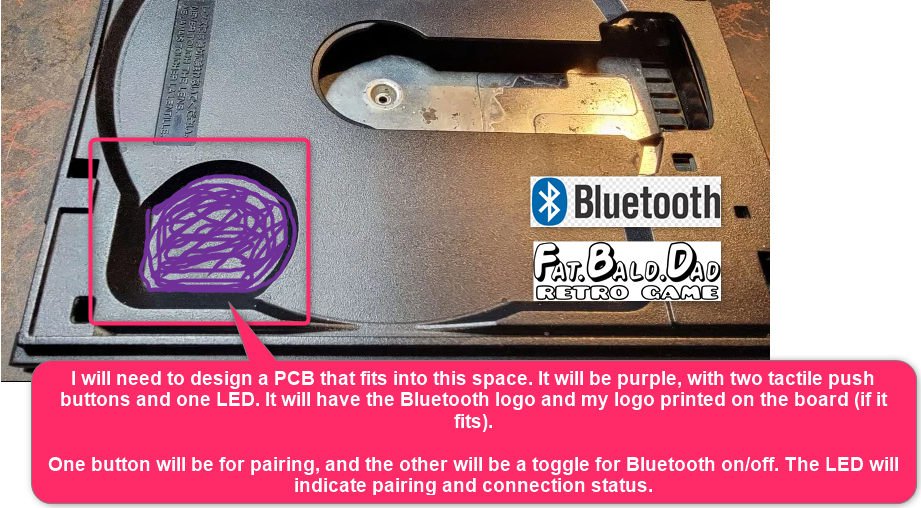
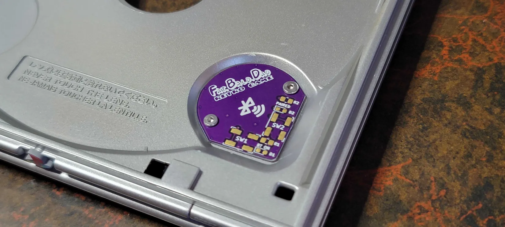
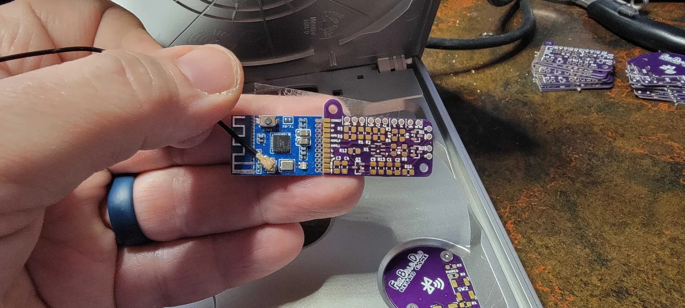
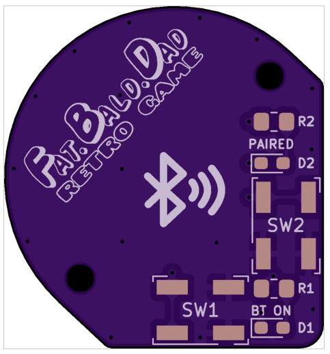
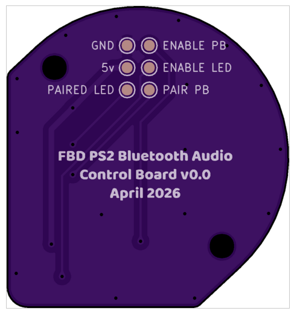
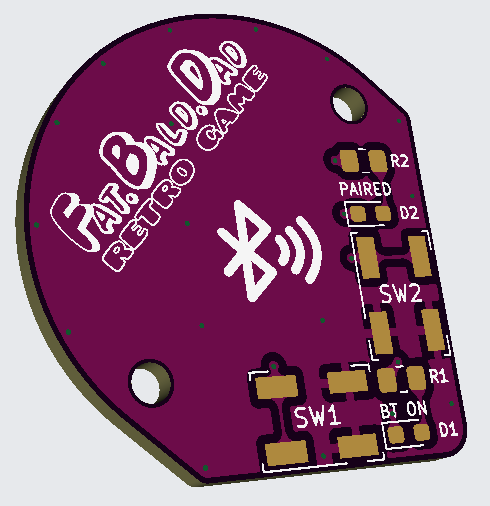
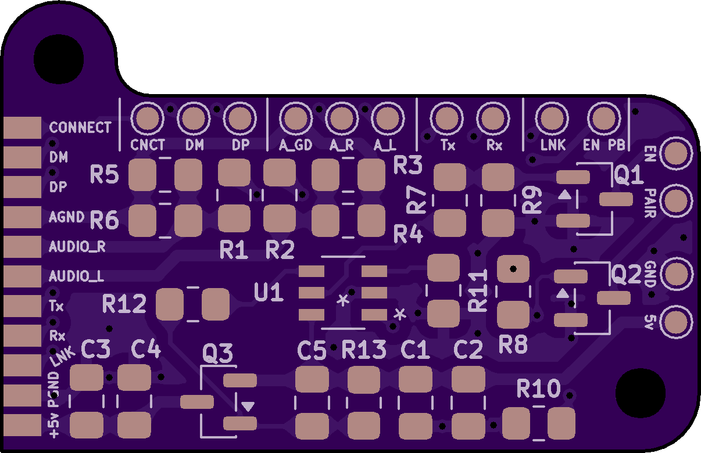
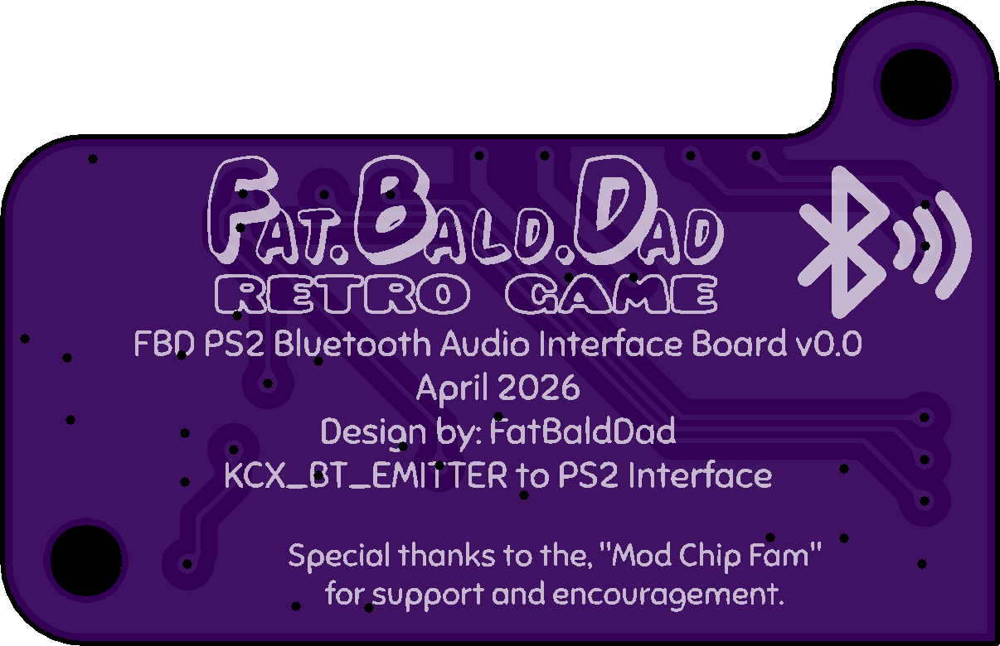

  <picture>
    <source media="(prefers-color-scheme: dark)" srcset="Images/Logos/PS2-BlueZZZ-Logo-Dark.png">
    <source media="(prefers-color-scheme: light)" srcset="Images/Logos/PS2-BlueZZZ-Logo-Light.png">
    
  </picture>

# PS2 BlueZZZ

**Bluetooth audio for quiet late-night PlayStation 2 gaming.**

PS2 BlueZZZ is an open hardware project for adding internal Bluetooth audio to a PlayStation 2 Slim console.

The project is built around a Bluetooth audio emitter module, a custom interface board, a controller board, and internal mounting hardware. The goal is to make Bluetooth audio installs cleaner, easier to solder, easier to mount, and easier to reproduce.

## Why This Project Exists

The idea behind PS2 BlueZZZ is simple:

Play PS2 games late at night with Bluetooth headphones without disturbing anyone nearby.

Directly wiring a Bluetooth audio emitter into a PS2 Slim can work, but it is not always clean, repeatable, or easy to service. The PS2 BlueZZZ interface board is designed to make the install cleaner and more practical.

## Main Features

- Internal Bluetooth audio support for PS2 Slim consoles
- Interface board designed to sit flush with the Bluetooth audio emitter
- Edge solder pads for cleaner soldering
- Audio attenuation to help prevent distorted audio
- MAX16054 pushbutton on/off controller
- Push-on / push-off Bluetooth audio power control
- Separate controller board for user-facing buttons and indicators
- Internal mounting bracket support
- Revision tracking for board changes and improvements
- Central location for schematics, PCB files, BOMs, install notes, and test data

## Project Sections

| Section | Purpose |
|---|---|
| `Hardware/` | KiCad files, PCB files, board renders, BOMs, and hardware notes |
| `Documents/` | Design notes, explanations, installation planning, and testing notes |
| `Manufacturing/` | Assembly notes, fabrication notes, and QA checklist |
| `Images/` | Logos, board renders, install photos, and repo images |
| `References/` | Datasheets, links, source notes, and related documentation |
| `Test-Data/` | Audio tests, power tests, fitment tests, and validation notes |

## Current Status

This project is currently in development and testing.

The first revision focuses on proving the interface board, audio attenuation, pushbutton power control, and PS2 Slim fitment.

---

## Concept and Install Examples

These images show the early PS2-BlueZZZ concept layout and prototype install examples.  
Click any thumbnail to view the full-size image.

<table>
  <tr>
    <td align="center" width="33%">
      
       
      <strong>Control Board Concept</strong>
       
      Early concept image showing the planned control board placement and fitment idea.
    </td>
    <td align="center" width="33%">
      
       
      <strong>Control Board Prototype Example</strong>
       
      Prototype control board example used to test button placement, wiring, and PS2 Slim fitment.
    </td>
    <td align="center" width="33%">
      
       
      <strong>Interface Board Prototype Example</strong>
       
      Prototype interface board example showing the Bluetooth audio emitter integration concept.
    </td>
  </tr>
</table>

## Board Renders

These renders show the current PS2-BlueZZZ control board and interface board layouts.  
Click any thumbnail to view the full-size image.

<table>
  <tr>
    <td align="center" width="33%">
      
       
      <strong>Control Board Render 01</strong>
       
      Main control board render.
    </td>
    <td align="center" width="33%">
      
       
      <strong>Control Board Render 02</strong>
       
      Alternate view of the control board.
    </td>
    <td align="center" width="33%">
      
       
      <strong>Control Board Render 03</strong>
       
      Additional control board render view.
    </td>
  </tr>
  <tr>
    <td align="center" width="33%">
      
       
      <strong>Interface Board Render 01</strong>
       
      Interface board render showing the board layout.
    </td>
    <td align="center" width="33%">
      
       
      <strong>Interface Board Render 02</strong>
       
      Alternate interface board render view.
    </td>
    <td align="center" width="33%">
      <!-- Empty cell used to keep layout balanced -->
    </td>
  </tr>
</table>

## Disclaimer

This is a hobby hardware project for modifying PlayStation 2 consoles.

Installing this board requires soldering, disassembly, and modification of original console hardware. Use at your own risk. Always verify wiring, polarity, audio routing, and power connections before powering the console.

## License

License information will be added in the `LICENSE` file.

## AI Assistance and Attribution Disclaimer

This project uses AI tools to help with writing, organization, documentation, research, code examples, and design planning. While I review and edit the information, some details may still be incorrect, incomplete, or outdated.

Not all ideas, code, research, methods, or technical information in this project should be credited only to me. This project may reference, build on, or be inspired by community knowledge, open-source projects, datasheets, forum posts, Discord discussions, manufacturer documentation, and the work of other developers and modders.

Credit will be given whenever a source is known. If something is missing credit or needs correction, please let me know so I can update the documentation.
